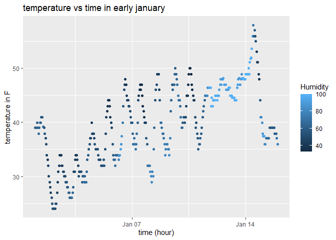

p8105_hw1_ei2291
================
2025-09-15

\#Problem 0.2. Calculating Mean of the Class Exam grades

``` r
exam_scores <- c(88,90,70,95)
mean_score <- mean(exam_scores)
print (mean_score)
```

    ## [1] 85.75

\#Problem 1 \#Installed file using “install.packages(”moderndive”)” in
console

\#loading library needed

``` r
library(moderndive)
library(tidyverse)
```

    ## ── Attaching core tidyverse packages ──────────────────────── tidyverse 2.0.0 ──
    ## ✔ dplyr     1.1.4     ✔ readr     2.1.5
    ## ✔ forcats   1.0.0     ✔ stringr   1.5.1
    ## ✔ ggplot2   3.5.2     ✔ tibble    3.3.0
    ## ✔ lubridate 1.9.4     ✔ tidyr     1.3.1
    ## ✔ purrr     1.0.4     
    ## ── Conflicts ────────────────────────────────────────── tidyverse_conflicts() ──
    ## ✖ dplyr::filter() masks stats::filter()
    ## ✖ dplyr::lag()    masks stats::lag()
    ## ℹ Use the conflicted package (<http://conflicted.r-lib.org/>) to force all conflicts to become errors

\#load data set

``` r
data("early_january_weather")
```

\#after running “?early_january_weather” got all variables

\#Variables in dataset are origin, year, month, day, hour, dewp, humid,
wind_dir, wind_speed, wind_gust, precip, pressure, visib, and time_hour.

\#The important variables are: time_hour = date and hour of when it was
recorded temp = the temperature in Fahrenheit humid = relative humidity
the others are additional info.

\#Calculathe the mean temperature in early january weather The dataset
has 358 rows and 15 columns.

``` r
round(mean(early_january_weather$temp, na.rm=TRUE),1) 
```

    ## [1] 39.6

\#making a scatterplot

``` r
ggplot(early_january_weather, aes(x=time_hour, y=temp, color=humid))+geom_point()+
  labs(
    title = "temperature vs time in early january",
    x = "time (hour)",
    y = "temperature in F",
    color = "Humidity"
  )
```

<!-- -->
\#in the scatterplot we can see that as the temperature goes up and
down, rising during the daytime and falling at nigth. There is higher
humifity sometimes during colder hours, like as we can see in the middle
where temperature is aroung 30 degrees F and humidity is more than 80.

\#Saving scatterplot

``` r
ggsave("p1805_hw1_ei2291_scatterplot.pdf")
```

    ## Saving 7 x 5 in image

\#Problem 2 Creating a dataframe for each

``` r
p2_df=tibble(
  sample = rnorm(10),
  sample_greater_than_0 = sample > 0,
  character_vector = rep(c("strawberry", "pineapple","banana"), length.out = 10),
 factor_vector = factor(rep(c("A", "B", "C"), length.out = 10))
)
p2_df
```

    ## # A tibble: 10 × 4
    ##     sample sample_greater_than_0 character_vector factor_vector
    ##      <dbl> <lgl>                 <chr>            <fct>        
    ##  1 -0.903  FALSE                 strawberry       A            
    ##  2 -0.135  FALSE                 pineapple        B            
    ##  3  0.0844 TRUE                  banana           C            
    ##  4  2.06   TRUE                  strawberry       A            
    ##  5 -0.686  FALSE                 pineapple        B            
    ##  6  0.151  TRUE                  banana           C            
    ##  7 -0.0308 FALSE                 strawberry       A            
    ##  8  0.826  TRUE                  pineapple        B            
    ##  9 -1.41   FALSE                 banana           C            
    ## 10 -0.0891 FALSE                 strawberry       A

Taking the mean of each variable in the dataframe

``` r
mean(pull(p2_df, sample))
```

    ## [1] -0.01304928

``` r
mean(pull(p2_df, sample_greater_than_0))
```

    ## [1] 0.4

``` r
mean(pull(p2_df, character_vector))
```

    ## Warning in mean.default(pull(p2_df, character_vector)): argument is not numeric
    ## or logical: returning NA

    ## [1] NA

``` r
mean(pull(p2_df, factor_vector))
```

    ## Warning in mean.default(pull(p2_df, factor_vector)): argument is not numeric or
    ## logical: returning NA

    ## [1] NA

\#when trying to take the mean for all four variables only able to get
(works) for the random sample and logical vector sample \> 0; not able
to get mean for the character and factor vectors

Writing a code chunk that applies the as.numeric function to the
logical, character, and factor variables.

``` r
as.numeric(pull(p2_df, sample_greater_than_0))
as.numeric(pull(p2_df, character_vector))
```

    ## Warning: NAs introduced by coercion

``` r
as.numeric(pull(p2_df, factor_vector))
```

\#when “as.numeric” replaced mean the veriable “greather_than_0” had two
outputs with TRUE is 1 and FALSE is 0. For the “charachter_vector” it is
not convertable so it is NA, and finally for the “factor_vector” A,B,C
was converted to 1,2,3,respectively.
